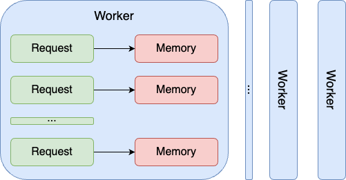
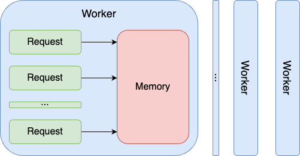

# Getting Symfony app ready for Swoole, RoadRunner, and FrankenPHP (no AI involved)

## Intro

Greetings dear reader! It has been a while since I wrote last time, so it is very nice to see you! And I hope this post will be interesting, and you find something fresh in it. On this note, I need to warn you: if you are familiar with the [Shared Memory Model](https://en.wikipedia.org/wiki/Shared_memory) that is introduced by [Swoole](https://github.com/swoole/swoole-src), and [RoadRunner](https://roadrunner.dev/), [FrankenPHP](https://frankenphp.dev/) and you are 100% certain that all the services in your codebase are stateless, you might skip reading further. Otherwise, welcome!

I will use a simple [Symfony 7.0](https://symfony.com/) application in this post, but all the concepts apply to any PHP codebase.


## The Problem

### Shared Nothing Model

Usually, the [PHP-FPM (FastCGI Process Manager)](https://www.php.net/manual/en/install.fpm.php) takes all requests for the PHP application and distributes them to individual PHP processes, also called workers. Each worker handles one request in a time. So the more workers are running, the more requests in parallel can be handled. In this case [Shared Nothing Model](https://en.wikipedia.org/wiki/Shared-nothing_architecture) is implemented by running the garbage collector to clear the memory between the requests (within the same worker). So no memory is shared between the requests:



There is nothing special about it, and it is how PHP applications have been running for a while.


### Shared Memory Model

But it changes after [Swoole](https://github.com/swoole/swoole-src) / [RoadRunner](https://roadrunner.dev/) / [FrankenPHP (Worker Mode)](https://frankenphp.dev/docs/worker/) is used. All of them use [Shared Memory Model](https://en.wikipedia.org/wiki/Shared_memory), which gives its power:



So within the same worker, the memory is shared to handle different requests. It leads to performance improvements, but in the same way, it might lead to some unexpected side effects, that are hard to notice and debug. Let's demonstrate the simplest way to reproduce it. 


## How to reproduce

We will use [php-shared-memory-model](https://github.com/SerheyDolgushev/php-shared-memory-model) repository to showcase unexpected side effects caused by the [Shared Memory Model](https://en.wikipedia.org/wiki/Shared_memory). It contains a single [TestController](https://github.com/SerheyDolgushev/php-shared-memory-model/blob/51dc506ebd987a42acc521476dbe46e06b87cc25/src/Controller/TestController.php) controller:
```php
<?php

declare(strict_types=1);

namespace App\Controller;

use Symfony\Bundle\FrameworkBundle\Controller\AbstractController;
use Symfony\Component\HttpFoundation\Request;
use Symfony\Component\HttpFoundation\Response;
use Symfony\Component\Routing\Annotation\Route;

class TestController extends AbstractController
{
    private int $counter = 0;

    #[Route(path: '/test', name: 'test', methods: [Request::METHOD_GET])]
    public function testAction(): Response
    {
        $content = '['.\date('c').'] Counter: '.(++$this->counter).PHP_EOL;

        return new Response($content, Response::HTTP_OK, ['Content-Type' => 'text/html']);
    }
}
```

And is quite simple to install:
```bash
cd ~/Projects
git clone git@github.com:SerheyDolgushev/php-shared-memory-model.git
cd php-shared-memory-model
composer install
```

Let's run it using local PHP server:
```bash
php -S 127.0.0.1:8000 public/index.php
```

And send a few test requests to the test controller:
```bash
% curl http://127.0.0.1:8000/test
[2024-02-24T08:05:03+00:00] Counter: 1
% curl http://127.0.0.1:8000/test
[2024-02-24T08:05:07+00:00] Counter: 1
% curl http://127.0.0.1:8000/test
[2024-02-24T08:05:10+00:00] Counter: 1
```

Nothing surprising at this point, all the responses return the expected counter. 

Now let's follow additional installation instructions for [Swoole](https://github.com/SerheyDolgushev/php-shared-memory-model/tree/main?tab=readme-ov-file#swoole), [RoadRunner](https://github.com/SerheyDolgushev/php-shared-memory-model/tree/main?tab=readme-ov-file#roadrunner), and [FrankenPHP](https://github.com/SerheyDolgushev/php-shared-memory-model/tree/main?tab=readme-ov-file#frankenphp), and run test the same controller in any of those runtimes (Swoole is used in this example):
```bash
APP_RUNTIME=Runtime\\Swoole\\Runtime php -d extension=swoole.so public/swoole.php
```

Test requests:
```bash
% curl http://127.0.0.1:8000/test
[2024-02-24T08:07:59+00:00] Counter: 1
% curl http://127.0.0.1:8000/test
[2024-02-24T08:08:02+00:00] Counter: 2
% curl http://127.0.0.1:8000/test
[2024-02-24T08:08:06+00:00] Counter: 3
```

As you can see, the counter value increased for each response, which is explained by the Shared Memory Model, but might be unexpected in some cases. And it definitely needs to be fixed.


## What to fix

At this point, it is clear that all the services need to be stateless, otherwise in some cases the app might behave in the unexpected way. In order to make sure all the services in our app are stateless we can manually check them. Which can be acceptable in smaller projects, but is very tedious in larger codebases. There should be a simpler way to do it, right? 

I feel now is the perfect moment to introduce the tool I have been working during the last few weekends. Ladies and gentlemen, please meet [phanalist](https://github.com/denzyldick/phanalist). It is a static analyzer for PHP projects, that is written in RUST. It is extremely easy to use: you just download compiled binary for your platform and run it (no PHP runtime is required). It comes with  [some useful rules](https://github.com/denzyldick/phanalist?tab=readme-ov-file#rules), but we will be focused on [E0012](https://github.com/denzyldick/phanalist/tree/27b18ec0292a79d57d29835f95d2ecaacf921ba7/src/rules/examples/e12). As this is the rule that checks if services are stateless.

Let's [install phanalist](https://github.com/denzyldick/phanalist/tree/main?tab=readme-ov-file#installation): 
```bash
% curl --proto '=https' --tlsv1.2 -sSf https://raw.githubusercontent.com/denzyldick/phanalist/main/bin/init.sh | sh

info: Downloading https://raw.githubusercontent.com/denzyldick/phanalist/main/release/aarch64-apple-darwin/phanalist ...
info: Saved /Users/sergiid/phanalist
```

And run it only against `E0012` rule, checking `./src` path:
```bash
% ~/phanalist -r E0012 -s ./src
The new ./phanalist.yaml configuration file as been created

Scanning files in ./src ...
██████████████████████████████████████████████████████████████████████████████████ 4/4
./src/Controller/TestController.php, detected 1 violations:
  E0012:	Setting service properties leads to issues with Shared Memory Model (FrankenPHP/Swoole/RoadRunner). Trying to set $this->counter property
  19:52	|         $content = '['.\date('c').'] Counter: '.(++$this->counter).PHP_EOL;

+-----------+------------------------------------------------+------------+
| Rule Code | Description                                    | Violations |
+-----------+------------------------------------------------+------------+
| E0012     | Service compatibility with Shared Memory Model |          1 |
+-----------+------------------------------------------------+------------+

Analysed 2 files in 2.30ms, memory usage: 4.6 MiB
```

After the first run `./phanalist.yaml` will be created. And depending on your project, you might want to adjust configurations for `E0012` rule.

Most likely, you will get a different output for your project. But it will contain all the stateful services, that need to be converted to stateless.

## How to fix

Converting a list of services to stateless might be not such an easy task, especially if there are a lot of services that you are not familiar with. Manually modifying the code that sets the state for the service might be very challenging, because of myriad of reasons: you might not be aware of all the use cases for the service/it might be a legacy code that is hard to understand/you name it. And again, there should be a better approach to handle it, right?

The good news is that there is a better and simpler way to do it: Symfony provides a [ResetInterface](https://github.com/symfony/symfony/blob/7.0/src/Symfony/Contracts/Service/ResetInterface.php) interface, that is designed to be used exactly in cases like this. Hopefully, other frameworks have something similar.

So now we need just to apply [ResetInterface](https://github.com/symfony/symfony/blob/7.0/src/Symfony/Contracts/Service/ResetInterface.php) for each stateful service. So [TestController](https://github.com/SerheyDolgushev/php-shared-memory-model/blob/51dc506ebd987a42acc521476dbe46e06b87cc25/src/Controller/TestController.php) will become:
```bash
% git diff src/Controller/TestController.php
diff --git a/src/Controller/TestController.php b/src/Controller/TestController.php
index 82b06b3..e01962c 100644
--- a/src/Controller/TestController.php
+++ b/src/Controller/TestController.php
@@ -8,8 +8,9 @@ use Symfony\Bundle\FrameworkBundle\Controller\AbstractController;
 use Symfony\Component\HttpFoundation\Request;
 use Symfony\Component\HttpFoundation\Response;
 use Symfony\Component\Routing\Annotation\Route;
+use Symfony\Contracts\Service\ResetInterface;
 
-class TestController extends AbstractController
+class TestController extends AbstractController implements ResetInterface
 {
     private int $counter = 0;
 
@@ -20,4 +21,9 @@ class TestController extends AbstractController
 
         return new Response($content, Response::HTTP_OK, ['Content-Type' => 'text/html']);
     }
+
+    public function reset()
+    {
+        $this->counter = 0;
+    }
 }
```

Let's restart Swoole runtime after this change
```bash
APP_RUNTIME=Runtime\\Swoole\\Runtime php -d extension=swoole.so public/swoole.php
```

And send a few test requests:
```bash
% curl http://127.0.0.1:8000/test
[2024-03-04T09:37:29+00:00] Counter: 1
% curl http://127.0.0.1:8000/test
[2024-03-04T09:37:30+00:00] Counter: 1
% curl http://127.0.0.1:8000/test
[2024-03-04T09:37:31+00:00] Counter: 1
```

As you can see, now the counter values for each response are the same as expected.

And I worth to mention that [phanalist](https://github.com/denzyldick/phanalist) is smart enough to not report controllers that implement `ResetInterface` (configurable in `phanalist.yaml`). So `./src/Controller/TestController.php` is not included in its output anymore:
```bash
% ~/phanalist -r E0012 -s ./src
Using configuration file ./phanalist.yaml

Scanning files in ./src ...
██████████████████████████████████████████████████████████████████████████████████ 4/4
Analysed 2 files in 9.26ms, memory usage: 4.9 MiB
```

## Conclusions

Shared Memory Model examples are reproducible only within the same worker, that's why all runtimes [php-shared-memory-model](https://github.com/SerheyDolgushev/php-shared-memory-model) are forced to a single worker. Reproduce similar cases in a production environment there might be dozens for running workers might be very tricky.

I hope this post introduced something new for you and provided you with a simple solution to a complex problem. Wish you to run your PHP apps faster and always get the expected results! :)